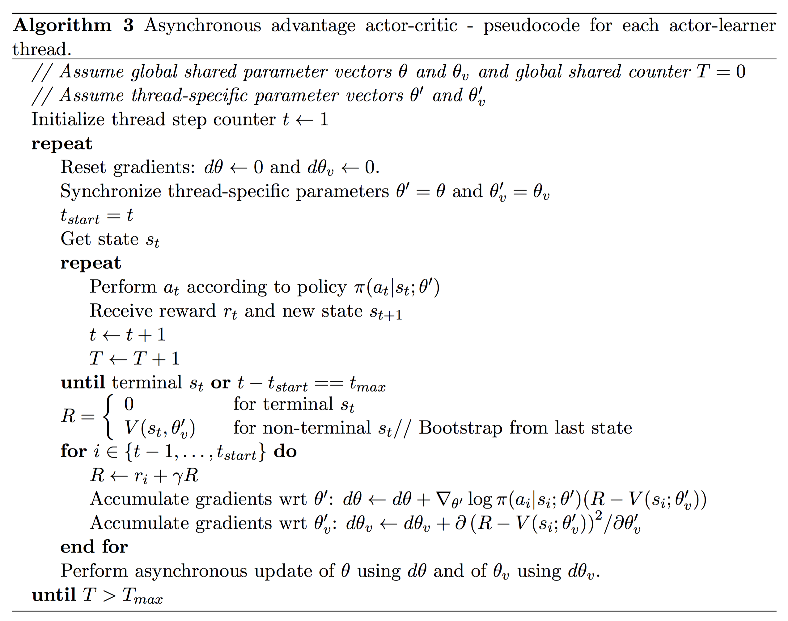

# Asynchronous Methods for Deep Reinforcement Learning

Tensorflow implementation of [Asynchronous Methods for Deep Reinforcement Learning](http://arxiv.org/abs/1602.01783).

## Requirements

- Python 2.7 or Python 3.3+
- [gym](https://github.com/openai/gym)
- [tqdm](https://github.com/tqdm/tqdm)
- [OpenCV2](http://opencv.org/) or [Scipy](https://www.scipy.org/)
- [TensorFlow](https://www.tensorflow.org/)

## Usage

First, install prerequisites with:

    $ pip install tqdm gym[all]

To train a model for SpaceInvaders:

    $ CUDA_VISIBLE_DEVICES="" python main.py --use_thread=True

## Results

(in progress)

## References

- [async_rl](https://github.com/muupan/async-rl)
- [async_deep_reinforce](https://github.com/miyosuda/async_deep_reinforce)
- [asynchronous computation in TensorFlow](http://stackoverflow.com/questions/34419645/asynchronous-computation-in-tensorflow)

## License

MIT License.
